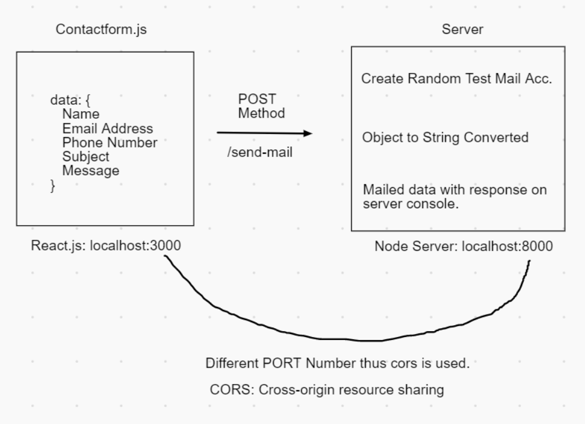

<h1> Project Title Here </h1>

<i><b>Fig</b>: Project Architecture</i>
 

    <b>Explanation</b>: Normal Project explanation where the data from frontend is passed to backend and mailed. Form validation is also done.

    <b>Tech Stack</b>: React.js(frontend), Node.js(backend)

<h4> Server Configuration </h4>

<b>Packages Installed:</b>
`"body-parser": "^1.19.0"` Handle JSON like objects in http data transmission,
`"cors": "^2.8.5"` Allow frontend hosted on different server to perform CRUD operation,
`"dotenv": "^8.2.0"` Store configuration data into server environment,
`"express": "^4.17.1" Server framework for Node.js`,
`"morgan": "^1.10.0"` Console http requests,
`"nodemailer": "^6.5.0"` Mail service API,
`"nodemon": "^2.0.7"` Continous integration with node server.

    <b>Main Section:</b>

    let testAccount = await nodemailer.createTestAccount();
    let transporter = nodemailer.createTransport({
      host: "smtp.ethereal.email",
      port: 587,
      secure: false,
      auth: {
        user: testAccount.user,
        pass: testAccount.pass,
      },
    });

    let info = await transporter.sendMail({
      from: `"E Gov Project" <${testAccount.user}>`,
      to: "Nagarjuna College, nagarjunacollege@example.com", 
      subject: "Hello ✔",
      text: JSON.stringify(req.body)
    });

    console.log("\nMessage sent: %s", info.messageId);
    console.log("Preview URL: %s", nodemailer.getTestMessageUrl(info));

    res.status(200).json({
      msg: "Message Sent!",
    });

<h4>
    Frontend Configuration
</h4>

<b>Packages Installed:</b>
`"axios": "^0.21.1"` Send request to servers,
`"react-toastify": "^7.0.4"` Interactive alert toast,

    <b>Main Section:</b>

    axios({
      method: "post",
      url: "http://localhost:8000/send-mail",
      data: formData,
    })
      .then((res) => {
        if (res.status === 200) {
          //refreshdata
          setName("");
          setPhone("");
          setEmail("");
          setSubject("");
          setMsg("");

          toast.success("Mail Sent Successfully! 👍");
        }
      })
      .catch((error) => {
        console.log(error);
      });

